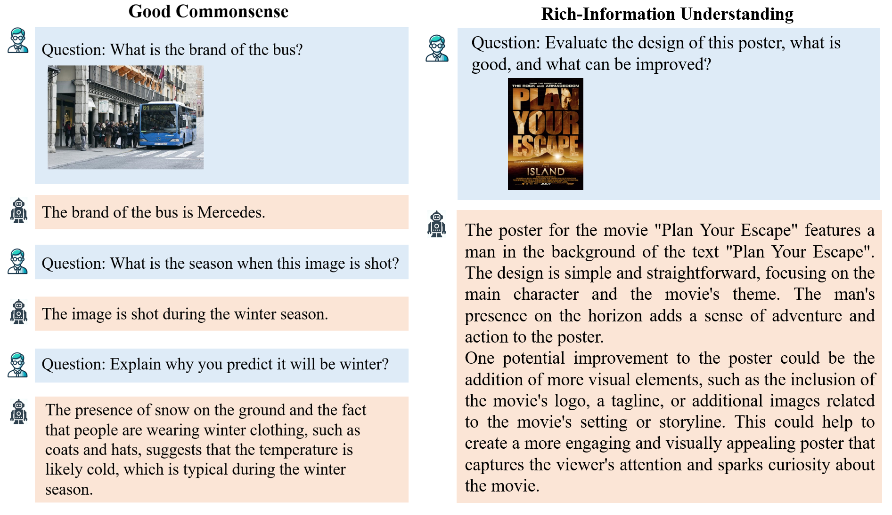

Text can be **bold**, _italic_, or ~~strikethrough~~.

[Link to another page](./another-page.html).

There should be whitespace between paragraphs.

There should be whitespace between paragraphs. We recommend including a README, or a file with information about your project.

# DEMO

There will be a demo

# Data

<table>
    <tr>
        <th>Stage</th><th>Dataset</th><th>Number</th><th>Download</th>
    </tr>
    <tr>
        <td rowspan="3">Stage1</td><td>LAION_CC_SBU</td><td>558,128</td><td><a href="https://huggingface.co/datasets/YunxinLi/Multimodal_Insturction_Data_V2">LAION_CC_SBU</a></td>
    </tr>
    <tr>
        <td>LLaVAR_pretrain</td><td>1,017,690</td><td><a href="https://llavar.github.io/#data">LLaVAR</a></td>
    </tr>
    <tr>
        <td>LMEye</td><td>3,489,001</td><td><a href="https://huggingface.co/datasets/YunxinLi/Multimodal_Insturction_Data_V2">LMEye</a></td>
    </tr>
    <tr>
        <td rowspan="2">Stage2</td><td>PF-1M</td><td>975,782</td><td><a href="https://huggingface.co/datasets/chendelong/PF-1M/tree/main">PF-1M</a></td>
    </tr>
    <tr>
        <td>ShareGPT4v_1.2M</td><td>1,246,901</td><td><a href="https://huggingface.co/datasets/Lin-Chen/ShareGPT4V">ShareGPT4V</a></td>
    </tr>
    <tr>
        <td rowspan="5">Stage3</td><td>LVIS-Instruct</td><td>888,008</td><td><a href="https://huggingface.co/datasets/X2FD/LVIS-Instruct4V">LVIS</a></td>
    </tr>
    <tr>
        <td>M<SUP>3</SUP>IT</td><td>955,435</td><td><a href="https://huggingface.co/datasets/MMInstruction/M3IT">M<SUP>3</SUP>IT</a></td>
    </tr>
    <tr>
        <td>SVIT_core</td><td>108,077</td><td><a href="https://huggingface.co/datasets/BAAI/SVIT">SVIT</a></td>
    </tr>
    <tr>
        <td>LAMM</td><td>185,892</td><td><a href="https://github.com/OpenGVLab/LAMM#lamm-dataset">LAMM</a></td>
    </tr>
    <tr>
        <td>ComVint</td><td>31,889</td><td><a href="https://github.com/RUCAIBox/ComVint#comvint-data">ComVint</a></td>
    </tr>
</table>

# Architecture

Our model is composed by a vision encoder and a large language model (LLM) connected by our30 proposed latent chain of thought (LatentCoT) projector which composes information from the vision encoder to form additional latent tokens. Given input image and text, our model first computes the image embedding using the vision encoder, then aligns the embedding with the LLM latent space using the projector, and finally concatenates the projected image latents with the tokenized input text for generating outputs using the LLM


# Performance

There will be performance

# Examples
<table>
    <tr>
        <td></td>
    </tr>
</table>

# Bibtext

# Acknowledgement


## Header 2

> This is a blockquote following a header.
>
> When something is important enough, you do it even if the odds are not in your favor.

### Header 3

```js
// Javascript code with syntax highlighting.
var fun = function lang(l) {
  dateformat.i18n = require('./lang/' + l)
  return true;
}
```

```ruby
# Ruby code with syntax highlighting
GitHubPages::Dependencies.gems.each do |gem, version|
  s.add_dependency(gem, "= #{version}")
end
```

#### Header 4

*   This is an unordered list following a header.
*   This is an unordered list following a header.
*   This is an unordered list following a header.

##### Header 5

1.  This is an ordered list following a header.
2.  This is an ordered list following a header.
3.  This is an ordered list following a header.

###### Header 6

| head1        | head two          | three |
|:-------------|:------------------|:------|
| ok           | good swedish fish | nice  |
| out of stock | good and plenty   | nice  |
| ok           | good `oreos`      | hmm   |
| ok           | good `zoute` drop | yumm  |

### There's a horizontal rule below this.

* * *

### Here is an unordered list:

*   Item foo
*   Item bar
*   Item baz
*   Item zip

### And an ordered list:

1.  Item one
1.  Item two
1.  Item three
1.  Item four

### And a nested list:

- level 1 item
  - level 2 item
  - level 2 item
    - level 3 item
    - level 3 item
- level 1 item
  - level 2 item
  - level 2 item
  - level 2 item
- level 1 item
  - level 2 item
  - level 2 item
- level 1 item

### Small image


### Large image


### Definition lists can be used with HTML syntax.

<dl>
<dt>Name</dt>
<dd>Godzilla</dd>
<dt>Born</dt>
<dd>1952</dd>
<dt>Birthplace</dt>
<dd>Japan</dd>
<dt>Color</dt>
<dd>Green</dd>
</dl>

```
Long, single-line code blocks should not wrap. They should horizontally scroll if they are too long. This line should be long enough to demonstrate this.
```

```
The final element.
```

